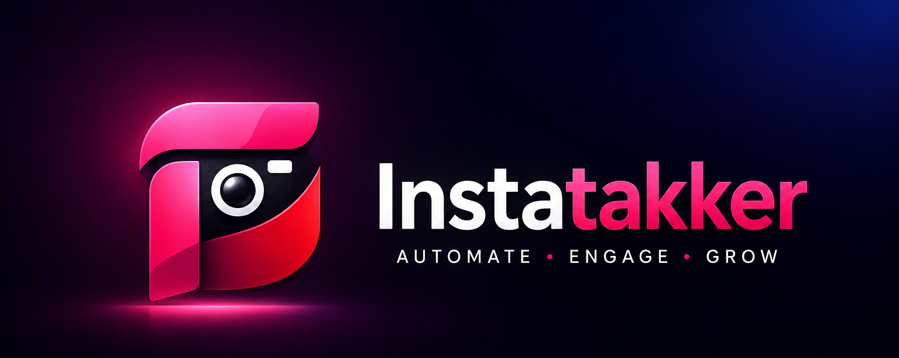

<p align="center">
  
</p>

<h1 align="center">InstaTakker App</h1>

<p align="center">
  Desktop Instagram workflow tool for liking user posts and managing unfollows with a built-in control panel.
</p>

<p align="center">
  <strong>Portable Windows App • Built-in Browser • Local Settings • Simple Controls</strong>
</p>

---
## Download for Windows

Go to the **Releases** page and download:

`Instatakker 1.0.0.exe`

No install needed. Just download and run the app.
## Overview

**InstaTakker App** is a desktop companion app for managing Instagram workflow tasks in one clean window.

It includes a built-in Instagram browser and a control panel that helps users run supported workflows such as liking posts from selected users and assisting with unfollowing accounts. The app is designed to make repetitive Instagram account management tasks easier to test, organize, and control.

The app works together with the InstaTakker browser script and provides a cleaner desktop experience instead of manually opening developer tools or editing scripts.

---

## Features

* Built-in Instagram browser
* Like user posts workflow
* Unfollow workflow
* Simple start and stop controls
* Adjustable action limits
* Local limit tracking
* Portable Windows `.exe`
* No installer required
* Clean desktop interface

---

## Download

Download the latest Windows portable version from the **Releases** section.

The app comes as a portable `.exe` file, so you can run it directly after downloading.

---

## How to Use

1. Download the latest InstaTakker `.exe` from Releases.
2. Open the app.
3. Click **Open Instagram**.
4. Log in to Instagram if needed.
5. Choose the workflow you want to use.
6. Adjust your settings.
7. Click **Start** or use the built-in control panel.

---

## Important Notice

InstaTakker is provided for **personal, educational, and workflow testing use only**.

Users are responsible for how they use the app. Automated or repeated actions may violate Instagram’s Terms of Service or trigger account limits, restrictions, or other enforcement actions.

Use responsibly and at your own risk.

---

## Disclaimer

InstaTakker is not affiliated with, endorsed by, sponsored by, or connected to Instagram, Meta, or any of their services.

This software is provided **as-is**, without warranty of any kind. The developer is not responsible for account restrictions, bans, disabled accounts, rate limits, data loss, misuse, or violations of platform rules.

---

## Development

Install dependencies:

```bash
npm install
```

Run the app locally:

```bash
npm start
```

Build the Windows portable app:

```bash
npm run build
```

The built app will appear in:

```text
dist/
```

---

## Project Structure

```text
instatakker-app/
├── build/
│   ├── icon.ico
│   ├── icon.png
│   ├── instatakker-icon.png
│   └── instatakker-logo.png
├── index.html
├── main.js
├── preload.js
├── renderer.js
├── styles.css
├── instatakker-core.js
├── package.json
└── README.md
```

---

## License

MIT License
